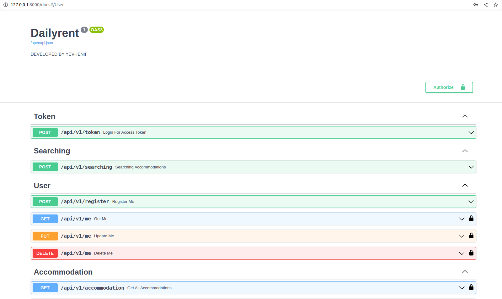
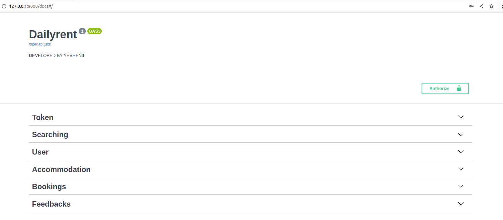
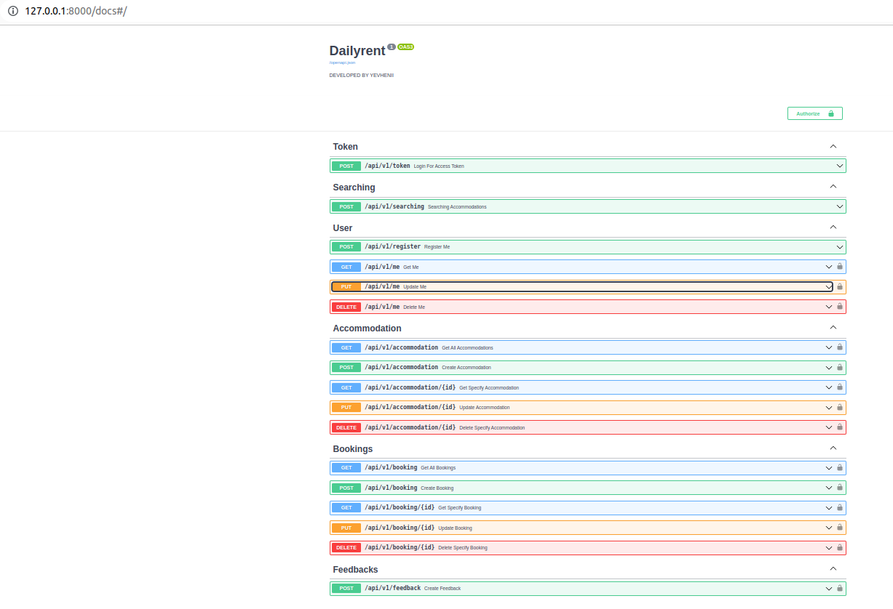
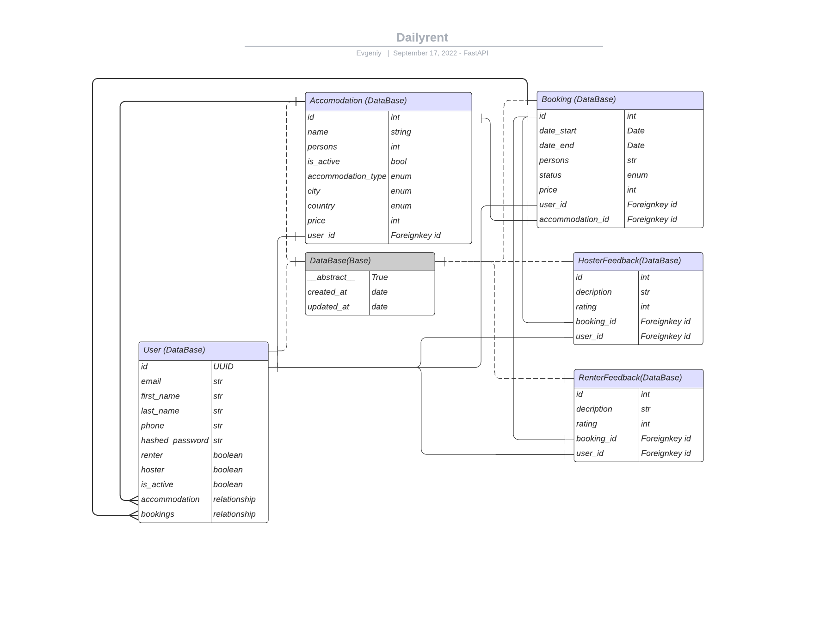
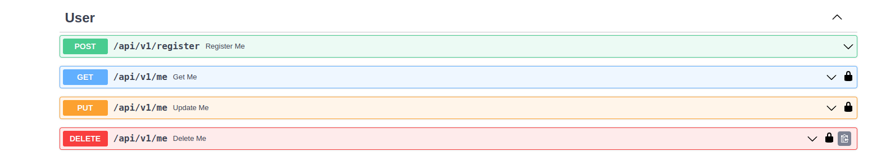
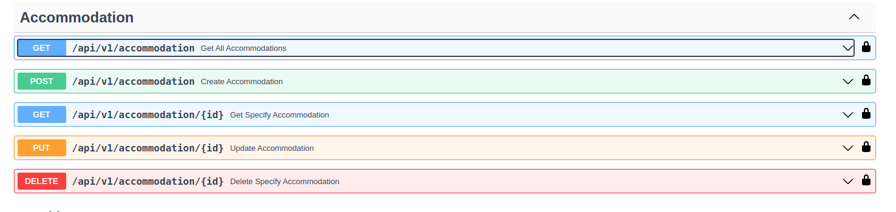
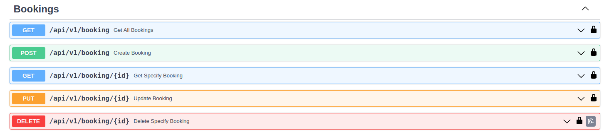
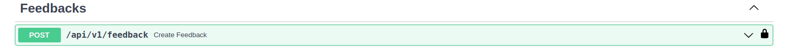
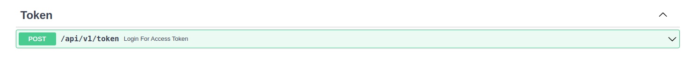

# Dailyrent project


## **Implemented in the project Dailyrent**

FastAPI REST API of a service for renting daily housing.
Entities: Users, Apartments, Bookings, Feedbacks

1. > The user can register as Hoster, Renter or both. This gives the user permission to create accommodation and bookings.

2. > Hoster can have several apartments for daily rent

3. > Renter can rent multiple apartments (even at the same time)
4. > Implemented rating system with comments (from 1 to 5 stars). The rating system can work in two directions: the renter can rate the apartment, the hoster can rate the renter, and also write a review.
5. > Async/await is used
6. > Background tasks for sending emails: after booking by the user.
7. > JWT authorization.
8. > Application testing
9. > Hashing password
10. > Setup router api/v1
11. > Create README.md


***
## **We use Python**
***
### **[Install]((https://www.python.org/downloads/release/python-3104/)) Python 3.10.4**

```bash
sudo apt install python3.10.4
```
***
## **Installation**

**1. Create folder dailyrent**

 
```bash
mkdir dailyrent
```
**2. Switch to folder dailyrent**


```bash
cd dailyrent
```

**3. Create virtual environment: venv**

```bash
python3 -m venv venv
```

**4.  Activate virtual environment: venv**

```bash
source venv/bin/activate
```

**5. Install all dependencies from file requirements.txt**

```bash
python3 -m pip install -r requirements.txt
```
***
## **Structure**
***

***
***


We use next file structure:

```bash
├── database
│   ├── app_db.py
│   └── __init__.py
├── endpoints
│   ├── accommodation.py
│   ├── booking.py
│   ├── feedback.py
│   ├── __init__.py
│   ├── me.py
│   ├── searching.py
│   └── token.py
├── main.py
├── models
│   ├── enum.py
│   ├── __init__.py
│   └── models.py
├── README.md
├── requirements.txt
├── schemas
│   ├── __init__.py
│   └── schemas.py
├── security
│   ├── __init__.py
│   └── security.py
├── services
│   ├── accommodation_service.py
│   ├── booking_service.py
│   ├── feedback_service.py
│   ├── __init__.py
│   └── user_service.py
├── tasks.py
└── tests
    ├── __init__.py
    └── test_main.py
```
- **__init__.py** - We have to use in each folder to connect all models to main.py
- **main.py** - Module for running application
- **requirements.txt** - file with all dependecies which need to run project
- **README.md** - project documentation
- **tasks.py** - background task

### Database
- **app_db.py** - Create connection to database

### Endpoints
- **accommodation.py** - CRUD operations with accommodations
- **booking.py** - CRUD operations with bookings
- **feedback.py** - create feedbacks for User (renter or hoster)
- **me.py** - CRUD operations with User
- **searching.py** - filtering accommodation with parameters 
- **token.py** - create access token (for email)

### Models
- **enum.py** - Enum constants
- **models.py** - all information about tables and reletionship wich save in DB

### Schemas
- **schemas.py** - Enum constants


### Security
- **security.py** - Enum constants


### Services
- **accommodation_service.py** - accommodation underneath here
- **booking_service.py** - bookings underneath here
- - **feedback_service.py** - feedback underneath here
- - **user_service.py** - users underneath here + token

### Tests
- **test_main.py** - all tests underneeth

***
## **Models Structure**
***
Tables and relationships:


***
## **Development**
***
First step to create an app after installing dependecies is to create **main.py**

### **CREATE - dailyrent/main.py**
```python
from fastapi import FastAPI
import uvicorn

# all endpoints we have to import in main.py, if we don't do it, we can't see them when we start the app
from endpoints import accommodation, booking, feedback, me, token, searching

# create instance FastAPI with additional information)
app = FastAPI(
        version=1,
        title='Dailyrent',
        description='DEVELOPED BY YEVHENII')

# here we connecting routers to main.py
# app.include_router (endpoint_module.router, prefix='path')
app.include_router(token.router, prefix='/api/v1', tags=["Token"])
app.include_router(searching.router, prefix='/api/v1', tags=["Searching"])
app.include_router(me.router, prefix='/api/v1', tags=["User"])
app.include_router(accommodation.router, prefix='/api/v1', tags=["Accommodation"])
app.include_router(booking.router, prefix='/api/v1', tags=["Bookings"])
app.include_router(feedback.router, prefix='/api/v1', tags=["Feedbacks"])


# this line we use when want to run app when starting main.py 
if __name__ == "__main__":
    uvicorn.run('main:app', port=8000, host='0.0.0.0', reload=True)
```

### **CREATE - dailyrent/database/app_db.py**

From [docs](https://fastapi.tiangolo.com/tutorial/sql-databases/) we choose to use SQLite and ORM SQLAlchemy in **app_db.py**.

```python
from sqlalchemy import create_engine
from sqlalchemy.ext.declarative import declarative_base
from sqlalchemy.orm import sessionmaker

# here you can write name DB and path
SQLALCHEMY_DATABASE_URL = "sqlite:///./dailyrent.db"

engine = create_engine(
    SQLALCHEMY_DATABASE_URL, connect_args={"check_same_thread": False}
)
SessionLocal = sessionmaker(autocommit=False, autoflush=False, bind=engine)

Base = declarative_base()

# Dependency
def get_db():
    db = SessionLocal()
    try:
        yield db
    finally:
        db.close()
```
### **CREATE - dailyrent/endpoints/me.py**

```python
from fastapi import APIRouter, Depends, status
from sqlalchemy.orm import Session

from database.app_db import get_db
from schemas.schemas import BaseUserScheme, UserCreateScheme, UserRetrieveScheme
from services.user_service import user_services

#in every endpoint we have to use this code, it gives us opportunity connecting to main.py. It's APIrouter and we import it from library also.
router = APIRouter()

#@roter.method - like this we need to use.
@router.post('/register', response_model=BaseUserScheme, status_code=status.HTTP_201_CREATED)
async def register_me(schema: UserCreateScheme, db: Session = Depends(get_db)):
    return await user_services.create_user(db, schema)


@router.get('/me', response_model=UserRetrieveScheme, status_code=status.HTTP_200_OK)
async def get_me(current_user: BaseUserScheme = Depends(user_services.get_current_is_active_user)):
    return current_user


@router.put('/me', response_model=UserRetrieveScheme, status_code=status.HTTP_200_OK)
async def update_me(schema: BaseUserScheme, current_user: UserRetrieveScheme = Depends(user_services.get_current_is_active_user), db: Session = Depends(get_db)):
    return await user_services.update_user(db, schema, current_user.email)


@router.delete('/me', status_code=status.HTTP_204_NO_CONTENT)
async def delete_me(current_user: UserRetrieveScheme = Depends(user_services.get_current_is_active_user), db: Session = Depends(get_db)):
    return await user_services.delete_user(db, current_user.email)
```
## **User endpoints view**



>**response_model=**  -  here we use for example pydentic scheme, what user need to get.

> **status_code=** - help us to show function result

> **db: Session = Depends(get_db)** - give us db with session to db

> **current_user: BaseUserScheme = Depends(user_services.get_current_is_active_user)** - this dependency give us current_user and we always can access user information. In turn, we receive this information after authorization, indicating the email and password. In this application, we do these actions with OAUTH2 authurization form.  

### **CREATE - dailyrent/endpoints/accommodation.py**

```python
from fastapi import APIRouter, Depends, status
from sqlalchemy.orm import Session

from database.app_db import get_db
from models.enum import AccommodationCity, AccommodationCountry, AccommodationType
from schemas.schemas import AccommodationScheme, BaseAccommodationScheme, UserRetrieveScheme
from services.accommodation_service import accommodation_services
from services.user_service import user_services

router = APIRouter()


@router.post('/accommodation', response_model=BaseAccommodationScheme, status_code=status.HTTP_201_CREATED)
async def create_accommodation(
                                accommodation_type: AccommodationType,
                                city: AccommodationCity,
                                country: AccommodationCountry,
                                schema: BaseAccommodationScheme,
                                current_user: UserRetrieveScheme = Depends(user_services.get_current_is_active_user),
                                db: Session = Depends(get_db)):
    return await accommodation_services.create_accommodation(accommodation_type, city, country, schema, current_user, db)


@router.get('/accommodation', status_code=status.HTTP_200_OK)
async def get_all_accommodations(db: Session = Depends(get_db), current_user: UserRetrieveScheme = Depends(user_services.get_current_is_active_user)):
    return await accommodation_services.get_all_accommodations(db, current_user)


@router.get('/accommodation/{id}', status_code=status.HTTP_200_OK)
async def get_specify_accommodation(
                                id: int,
                                current_user: UserRetrieveScheme = Depends(user_services.get_current_is_active_user),
                                db: Session = Depends(get_db)):

    return await accommodation_services.get_accommodation(db, id, current_user)


@router.delete('/accommodation/{id}', status_code=status.HTTP_204_NO_CONTENT)
async def delete_specify_accommodation(
                                id: int,
                                current_user: UserRetrieveScheme = Depends(user_services.get_current_is_active_user),
                                db: Session = Depends(get_db)):

    return await accommodation_services.delete_accommodation(db, id, current_user)


@router.put('/accommodation/{id}', response_model=AccommodationScheme, status_code=status.HTTP_200_OK)
async def update_accommodation(
                                id: int,
                                accommodation_type: AccommodationType,
                                city: AccommodationCity,
                                country: AccommodationCountry,
                                schema: AccommodationScheme,
                                current_user: UserRetrieveScheme = Depends(user_services.get_current_is_active_user),
                                db: Session = Depends(get_db)):

    return await accommodation_services.update_accommodation(db, id, current_user, schema, accommodation_type, city, country)

```
## **Accommodation endpoints view**


### **CREATE - dailyrent/endpoints/booking.py**
```python
from fastapi import APIRouter, Depends, status, BackgroundTasks
from sqlalchemy.orm import Session

from database.app_db import get_db
from models.enum import BookingStatus
from schemas.schemas import BaseBookingScheme, BookingScheme, UserRetrieveScheme
from services.booking_service import booking_services
from services.user_service import user_services

router = APIRouter()

#Here We use background_tasks: BackgroundTasks
@router.post('/booking', response_model=BookingScheme, status_code=status.HTTP_201_CREATED)
async def create_booking(
                        background_tasks: BackgroundTasks, 
                        schema: BaseBookingScheme,
                        current_user: UserRetrieveScheme = Depends(user_services.get_current_is_active_user),
                        db: Session = Depends(get_db)):

    return await booking_services.create_booking(db, schema, current_user, background_tasks)


@router.get('/booking', status_code=status.HTTP_200_OK)
async def get_all_bookings(status: BookingStatus | None = None, current_user: UserRetrieveScheme = Depends(user_services.get_current_is_active_user)):
    return await booking_services.check_status_booking(status, current_user.bookings)


@router.get('/booking/{id}', status_code=status.HTTP_200_OK)
async def get_specify_booking(
                        id: int,
                        current_user: UserRetrieveScheme = Depends(user_services.get_current_is_active_user),
                        db: Session = Depends(get_db)):

    return await booking_services.get_booking(db, id, current_user)


@router.delete('/booking/{id}', status_code=status.HTTP_204_NO_CONTENT)
async def delete_specify_booking(
                        id: int,
                        current_user: UserRetrieveScheme = Depends(user_services.get_current_is_active_user),
                        db: Session = Depends(get_db)):
    return await booking_services.delete_booking(db, id, current_user)


@router.put('/booking/{id}', response_model=BookingScheme, status_code=status.HTTP_200_OK)
async def update_booking(
                        id: int,
                        schema: BookingScheme,
                        current_user: UserRetrieveScheme = Depends(user_services.get_current_is_active_user),
                        db: Session = Depends(get_db)):

    return await booking_services.update_booking(db, id, current_user, schema)
```
> **background_tasks: BackgroundTasks** - Dependecy for background_tasks.
## **Booking endpoints view**


### **CREATE - dailyrent/endpoints/feedback.py**
```python
from fastapi import APIRouter, Depends, status, BackgroundTasks
from sqlalchemy.orm import Session

from database.app_db import get_db
from models.enum import FeedbackRating
from schemas.schemas import BaseFeedbackScheme, UserRetrieveScheme
from services.feedback_service import feedback_services
from services.user_service import user_services

router = APIRouter()


@router.post('/feedback', status_code=status.HTTP_201_CREATED)
async def create_feedback(
                        rating: FeedbackRating,
                        background_tasks: BackgroundTasks, 
                        schema: BaseFeedbackScheme,
                        current_user: UserRetrieveScheme = Depends(user_services.get_current_is_active_user),
                        db: Session = Depends(get_db)):
    return await feedback_services.create_feedback(db, schema, current_user, rating, background_tasks)
```
## **Feedback endpoints view**


### **CREATE - dailyrent/endpoints/searching.py**
```python
from datetime import date
from fastapi import APIRouter, Depends, status
from sqlalchemy.orm import Session

from database.app_db import get_db
from models.enum import AccommodationCity, AccommodationCountry, AccommodationType
from services.accommodation_service import accommodation_services


router = APIRouter()

# --------------------------------------------------/api/v1/searching---------------------------------------------------------------------------------

@router.post('/searching', status_code=status.HTTP_200_OK)
async def searching_accommodations(
                                    date_start: date,
                                    date_end: date,
                                    country: AccommodationCountry | None = None,
                                    city: AccommodationCity | None = None,
                                    accommodation_type: AccommodationType | None = None,
                                    persons: int | None = None, 
                                    db: Session = Depends(get_db)):
    '''
        Func returns all accommodation:
        - without filters;
        - filtered by country;
        - filteredf by city;
        - filtered by type of accommodation;
        - filtered by persons;
        - filtered all available for status code (waiting and approved go in);
        - filtered all available for the searching dates
    '''

    return await accommodation_services.searching_accommodations(date_start, date_end, country, city, accommodation_type, persons, db)
```
## **Searching endpoint view**


### **CREATE - dailyrent/endpoints/token.py**


```python
from datetime import timedelta
from fastapi import Depends, HTTPException, status
from fastapi.security import OAuth2PasswordRequestForm
from sqlalchemy.orm import Session

from database.app_db import get_db
from services.user_service import user_services
from schemas.schemas import Token
from security.security import ACCESS_TOKEN_EXPIRE_MINUTES, create_access_token

from fastapi import APIRouter

router = APIRouter()

# --------------------------------------------------/api/v1/token---------------------------------------------------------------------------------
# Endpoint what 
@router.post("/token", response_model=Token)
async def login_for_access_token(db: Session = Depends(get_db), form_data: OAuth2PasswordRequestForm = Depends()):
    user = await user_services.authenticate_user(db, form_data.username, form_data.password)
    if not user:
        raise HTTPException(
            status_code=status.HTTP_401_UNAUTHORIZED,
            detail="Incorrect username or password",
            headers={"WWW-Authenticate": "Bearer"},
        )
    access_token_expires = timedelta(minutes=ACCESS_TOKEN_EXPIRE_MINUTES)
    access_token = await create_access_token(data={"sub": user.email}, expires_delta=access_token_expires)
    return {"access_token": access_token, "token_type": "bearer"}

```
>**{"sub": user.email}** - here we can see that we coding User email in token Key.

> **(minutes=ACCESS_TOKEN_EXPIRE_MINUTES)** - time for token live
## **Token endpoint view**


### **CREATE - dailyrent/models/enum.py**
Enum - helps us to create CONSTANT and 
and call to them in any part of the application. Also easy to change in one place and automatically in another places in application it will change.
```python
from enum import Enum


class AccommodationType(Enum):
    FLAT = 'Flat'
    HOUSE = 'House'
    VILLA = 'Villa'
    HOTEL = 'Hotel'


class AccommodationCountry(Enum):
    ARGENTINA = 'Argentina'
    SPAIN = 'Spain'
    NETHERLANDS = 'Netherlands'
    POLAND = 'Poland'


class AccommodationCity(Enum):
    MADRID = 'Madrid'
    AMSTERDAM = 'Amsterdam'
    WARSAWA = 'Warsawa'
    BUDAPEST = 'Budapest'


class BookingStatus(Enum):
    WAITING = 'waiting'
    APPROVED = 'approved'
    DECLINED = 'declined'
    FINISHED = 'finished'


class FeedbackRating(Enum):
    VERY_BAD = 1
    BAD = 2
    SO_SO = 3
    GOOD = 4
    BEST = 5

```
### **CREATE - dailyrent/models/models.py**

```python
from sqlalchemy import Boolean, Column, ForeignKey, Integer, String, Date, Enum
from sqlalchemy.orm import relationship
from sqlalchemy_utils import UUIDType
import uuid

from database.app_db import Base, engine
from models.enum import AccommodationCountry, AccommodationType, BookingStatus, AccommodationCity, AccommodationCountry

# ------------------------------------------------------Abstract---------------------------------------------------------------------------------
# Abstract class, we use __abstract__ = True
class DataBase(Base):
    __abstract__ = True
    created_at = Column(Date)
    updated_at = Column(Date)

# ------------------------------------------------------User---------------------------------------------------------------------------------

class User(DataBase):
    __tablename__ = 'users'

    id = Column(UUIDType(binary=False), primary_key=True, default=uuid.uuid4())
    email = Column(String(100), unique=True, nullable=False)
    first_name = Column(String(50))
    last_name = Column(String(100))
    phone = Column(String(20))
    hashed_password = Column(String(100), nullable=False)
    renter = Column(Boolean, default=False)
    hoster = Column(Boolean, default=False)
    is_active = Column(Boolean, default=True)

    accommodations = relationship('Accommodation', backref='users', cascade='all, delete')
    bookings = relationship('Booking', backref='users')

# ------------------------------------------------------Accommodation---------------------------------------------------------------------------------

class Accommodation(DataBase):
    __tablename__ = 'accommodations'

    id = Column(Integer, primary_key=True, unique=True, nullable=False)
    name = Column(String(100), nullable=False)
    persons = Column(Integer)
    is_active = Column(Boolean, default=True)
    accommodation_type = Column(Enum(AccommodationType))
    city = Column(Enum(AccommodationCity))
    country = Column(Enum(AccommodationCountry))
    price = Column(Integer)
    user_id = Column(UUIDType(binary=False), ForeignKey('users.id'))

# --------------------------------------------------------Booking---------------------------------------------------------------------------------

class Booking(DataBase):
    __tablename__ = 'bookings'

    id = Column(Integer, primary_key=True, unique=True, nullable=False)
    date_start = Column(Date, nullable=False)
    date_end = Column(Date, nullable=False)
    persons = Column(Integer)
    status = Column(Enum(BookingStatus))
    price = Column(Integer)
    user_id = Column(UUIDType(binary=False), ForeignKey('users.id'))
    accommodation_id = Column(Integer, ForeignKey('accommodations.id'))

# --------------------------------------------------------RenterFeedback---------------------------------------------------------------------------------

class RenterFeedback(DataBase):
    __tablename__ = 'renter_feedbacks'

    id = Column(Integer, primary_key=True, unique=True, nullable=False)
    description = Column(String(200), nullable=False)
    rating = Column(Integer)
    booking_id = Column(Integer, ForeignKey('accommodations.id'))
    user_id = Column(UUIDType(binary=False), ForeignKey('users.id'))

# --------------------------------------------------------HosterFeedback---------------------------------------------------------------------------------

class HosterFeedback(DataBase):
    __tablename__ = 'hoster_feedbacks'

    id = Column(Integer, primary_key=True, unique=True, nullable=False)
    description = Column(String(200), nullable=False)
    rating = Column(Integer)
    booking_id = Column(Integer, ForeignKey('accommodations.id'))
    user_id = Column(UUIDType(binary=False), ForeignKey('users.id'))


#Create all tables: this line need to be after models!
Base.metadata.create_all(bind=engine)
```
### **CREATE - dailyrent/schemas/schemas.py**
```python
from datetime import date
from pydantic import BaseModel, EmailStr
import uuid

from models.enum import AccommodationCity, AccommodationCountry, AccommodationType, BookingStatus

# ----------------------------------------------------------User----------------------------------------------------------------------------------

class BaseUserScheme(BaseModel):
    # required
    email: EmailStr
    # required
    first_name: str
    # required
    last_name: str
    # no required and equal None
    phone: str | None = None
    # no required
    renter: bool = False
    # required
    hoster: bool = False
    # required
    is_active: bool

    class Config:
        orm_mode = True

class UserCreateScheme(BaseUserScheme):
    hashed_password: str

    class Config:
        orm_mode = True

class UserRetrieveScheme(BaseUserScheme):
    created_at: date
    updated_at: date | None

    class Config:
        orm_mode = True


# ---------------------------------------------------------Accommodation---------------------------------------------------------------------------------

class BaseAccommodationScheme(BaseModel):
    name: str
    persons: int | None = None
    is_active: bool
    created_at: date
    accommodation_type: AccommodationType | None = None
    city: AccommodationCity | None = None
    country: AccommodationCountry | None = None
    price: int | None = None

    class Config:
        orm_mode = True

class AccommodationScheme(BaseAccommodationScheme):
    created_at: date
    updated_at: date | None

    class Config:
        orm_mode = True

# ---------------------------------------------------------Booking---------------------------------------------------------------------------------

class BaseBookingScheme(BaseModel):
    date_start: date 
    date_end: date
    persons: int
    accommodation_id: int

    class Config:
        orm_mode = True


class BookingScheme(BaseBookingScheme):
    created_at: date
    updated_at: date | None
    price: int | None = None

    class Config:
        orm_mode = True


# ---------------------------------------------------------Feedbacks---------------------------------------------------------------------------------

class BaseFeedbackScheme(BaseModel):
    description: str
    rating: int
    booking_id: int

    class Config:
        orm_mode = True


class FeedbackScheme(BaseFeedbackScheme):
    created_at: date
    updated_at: date | None

    class Config:
        orm_mode = True


class RenterFeedbackScheme(BaseFeedbackScheme):
    renter_id: uuid.UUID

    class Config:
        orm_mode = True

class HosterFeedbackScheme(BaseFeedbackScheme):
    hoster_id: uuid.UUID

    class Config:
        orm_mode = True

# ---------------------------------------------------------Token---------------------------------------------------------------------------------


class Token(BaseModel):
    access_token: str
    token_type: str


class TokenData(BaseModel):
    email: str | None = None
```
> **Below part of code use every time when you create new class of Pydentic model for connecting to ORM**
> 
```python
class Config:
        orm_mode = True
```
### **CREATE - dailyrent/security/security.py**

You can read this block also in FastAPI [documentation](https://fastapi.tiangolo.com/tutorial/security/oauth2-jwt/)
```python
from base64 import b64encode
from datetime import datetime, timedelta
from jose import jwt
from fastapi.security import OAuth2PasswordBearer
from passlib.context import CryptContext
from secrets import token_bytes

from fastapi import APIRouter
router = APIRouter(tags=["Token"])


# -------------------------------------------------Hashing and Verify Password---------------------------------------------------------------------------------

# from FastAPI documentation
pwd_context = CryptContext(schemes=["bcrypt"], deprecated="auto")

# from FastAPI documentation
async def get_password_hash(password: str) -> str:
    return pwd_context.hash(password)

# from FastAPI documentation
async def verify_password(plain_password: str, hashed_password: str) -> bool:
    return pwd_context.verify(plain_password, hashed_password)


# -------------------------------------------------Oauth2---------------------------------------------------------------------------------
#For authentication
oauth2_scheme = OAuth2PasswordBearer(tokenUrl="api/v1/token")

# -------------------------------------------------JWT Token---------------------------------------------------------------------------------
# b64encode(token_bytes(32)).decode() - help us automatically generate Secret Key
SECRET_KEY = b64encode(token_bytes(32)).decode()
ALGORITHM = "HS256"
ACCESS_TOKEN_EXPIRE_MINUTES = 30

# from FastAPI documentation
async def create_access_token(data: dict, expires_delta: timedelta | None = None):
    to_encode = data.copy()
    if expires_delta:
        expire = datetime.utcnow() + expires_delta
    else:
        expire = datetime.utcnow() + timedelta(minutes=15)
    to_encode.update({"exp": expire})
    encoded_jwt = jwt.encode(to_encode, SECRET_KEY, algorithm=ALGORITHM)
    return encoded_jwt
```
> **oauth2_scheme** = OAuth2PasswordBearer(**tokenUrl="api/v1/token"**) - we use to authentication User. Important, don't forget about this path, becouse when you use routes and forgetting about this path your authentication will not working.
### **CREATE - dailyrent/services/accommodation_service.py**
```python
import datetime
from fastapi import HTTPException, status
from models.enum import BookingStatus

from models.models import Accommodation, Booking
from services.booking_service import booking_services


class AccommodationService():

    async def create_accommodation(self, accommodation_type, city, country, schema, current_user, db):
        if current_user.hoster:
            data = schema.dict()
            data['user_id'] = current_user.id
            data['accommodation_type'] = accommodation_type
            data['city'] = city
            data['country'] = country
            data['created_at'] = datetime.datetime.utcnow()
            user = Accommodation(**data)
            db.add(user)
            db.commit()
            db.refresh(user)
        else:
            raise HTTPException(status_code=status.HTTP_400_BAD_REQUEST,
                                detail="No rights to create accommodations")
        return user

    async def get_accommodation(self, db, id, current_user):
        accommodation = db.query(Accommodation).filter_by(user_id=current_user.id, id=id).first()
        return accommodation

    async def update_accommodation(self, db, id, current_user, schema, accommodation_type, city, country):
        data = schema.dict()
        data['accommodation_type'] = accommodation_type
        data['city'] = city
        data['country'] = country
        accommodation = await self.get_accommodation(db, id, current_user)
        for key, value in data.items():
            setattr(accommodation, key, value)
        accommodation.updated_at = datetime.datetime.utcnow()
        db.commit()
        db.refresh(accommodation)
        return accommodation

    async def delete_accommodation(self, db, id, current_user):
        specify_accommodation = db.query(Accommodation).filter_by(user_id=current_user.id, id=id).first()
        db.delete(specify_accommodation)
        db.commit()
        raise HTTPException(status_code=status.HTTP_200_OK, detail='Specify accommodation was deleted successfully')

    # 1. Filter accommodation by : country, city, type, persons and # 2. Filter also: If booking dates no match with search date.
    async def searching_accommodations(self, date_start, date_end, country, city, accommodation_type, persons, db):
        filtered_accommodation = []
        
        accommodation = db.query(Accommodation).all()

        for accommodation in accommodation:

            if ((accommodation.country == country or country is None) and
                (accommodation.city == city or city is None) and
                (accommodation.accommodation_type == accommodation_type or accommodation_type is None) and
                (accommodation.persons == persons or persons is None) and
                (await booking_services.check_is_available_booking(db, accommodation.id, date_start, date_end))):
                
                accommodation = {
                        'id': accommodation.id, 
                        'name': accommodation.name, 
                        'persons': accommodation.persons, 
                        'accommodation_type': accommodation.accommodation_type,
                        'city': accommodation.city,
                        'country': accommodation.country,
                        'price': accommodation.price,
                        'is_active': accommodation.is_active,
                        'created_at': accommodation.created_at,
                        'updated_at': accommodation.updated_at,
                                }
                filtered_accommodation.append(accommodation)

        if filtered_accommodation == []:
            raise HTTPException(status_code=status.HTTP_200_OK, detail='Sorry but no free accommodation')
        return filtered_accommodation


    async def get_all_accommodations(self, db, current_user):
        filtered_accommodation = []
        accommodation = db.query(Accommodation).filter_by(user_id=current_user.id).all()

        for accommodation in accommodation:
            bookings = db.query(Booking).filter_by(accommodation_id=accommodation.id).all()
            bookings = [
                        {           
                        'id': booking.id,
                        'date_start': booking.date_start,
                        'date_end': booking.date_end,
                        'persons': booking.persons,
                        'price': booking.price,
                        'status': booking.status,
                        'created_at': booking.created_at,
                        'updated_at': booking.updated_at}
                        for booking in bookings if booking.status == BookingStatus.WAITING or booking.status == BookingStatus.FINISHED ]

            accommodation = {
                        'id': accommodation.id, 
                        'name': accommodation.name, 
                        'persons': accommodation.persons, 
                        'accommodation_type': accommodation.accommodation_type,
                        'city': accommodation.city,
                        'country': accommodation.country,
                        'price': accommodation.price,
                        'is_active': accommodation.is_active,
                        'created_at': accommodation.created_at,
                        'updated_at': accommodation.updated_at,
                        'bookings': bookings}

            filtered_accommodation.append(accommodation)

        return filtered_accommodation

#create an instance and then refer to it in the project
accommodation_services = AccommodationService()
```
### **CREATE - dailyrent/services/booking_service.py**
```python
import enum
from datetime import datetime, timedelta, date
from fastapi import HTTPException, status

from models.models import Accommodation, Booking
from models.enum import BookingStatus
import tasks


class BookingService():

    async def create_booking(self, db, schema, current_user, background_tasks):
        '''
        Check and compare dates, if ok
        '''
        if current_user.renter:
            data = schema.dict()
            if self.check_is_available_booking(db, data['accommodation_id'], data['date_start'], data['date_end']) == True or None:
                accommodation = db.query(Accommodation).filter_by(id=data['accommodation_id']).first()
                data['user_id'] = current_user.id
                data['price'] = accommodation.price
                data['status'] = BookingStatus.WAITING
                data['created_at'] = datetime.utcnow()
                user = Booking(**data)
                db.add(user)
                db.commit()
                db.refresh(user)
                background_tasks.add_task(tasks.send_email)
                return user
            else:
                raise HTTPException(status_code=status.HTTP_400_BAD_REQUEST, detail="No dates to create bookings, choose another")        
        else:
            raise HTTPException(status_code=status.HTTP_400_BAD_REQUEST, detail="No rights to create bookings")


    async def get_booking(self, db, id, current_user):
        booking = db.query(Booking).filter_by(user_id=current_user.id, id=id).first()
        return booking

    async def update_booking(self, db, id, current_user, schema):
        data = schema.dict()
        booking = self.get_booking(db, id, current_user)
        for key, value in data.items():
            setattr(booking, key, value)
        booking.updated_at = datetime.datetime.utcnow()
        db.commit()
        db.refresh(booking)
        return booking

    async def delete_booking(self, db, id, current_user):
        specify_booking = db.query(Booking).filter_by(user_id=current_user.id, id=id).first()
        if specify_booking.status == BookingStatus.WAITING:
            db.delete(specify_booking)
            db.commit()
            raise HTTPException(status_code=status.HTTP_200_OK,
                                detail='Specify booking was deleted successfully')

    async def check_dates_booking(self, b1: date, b2: date, s1: date, s2: date) -> True:
        booking_period = [b1 + timedelta(days=x) for x in range((b2-b1).days + 1)]
        searching_period = [s1 + timedelta(days=x) for x in range((s2-s1).days + 1)]
        for book in booking_period:
            for search in searching_period:
                if book == search:
                    return True


    async def check_status_booking(self, status: enum, bookings):
        filtered_booking = [booking for booking in bookings if booking.status == status or status is None]
        return filtered_booking


    async def check_is_available_booking(self, db, accommodation_id, searching_date_start, searching_date_end):
        '''
        Func returns True if booking is available for searching:
        '''
        bookings = db.query(Booking).filter_by(accommodation_id=accommodation_id).all()
        if bookings == []: # if accommodation hasn't any bookings
            return True

        results = []
        for booking in bookings:
            
            if booking.status == BookingStatus.DECLINED or booking.status == BookingStatus.FINISHED:
                return True
            elif booking.status == BookingStatus.WAITING or booking.status == BookingStatus.APPROVED:
                # True if dates match!
                check_dates = await self.check_dates_booking(booking.date_start, booking.date_end, searching_date_start, searching_date_end)
                results.append(check_dates)
        if [bool for bool in results if bool is True]: # Check all bokings in one accommodation do they have True, if Yes, return False!
            return False
        else:
            return True

#create an instance and then refer to it in the project
booking_services = BookingService()
```
### **CREATE - dailyrent/services/feedback_service.py**
```python
from fastapi import HTTPException, status

from models.models import Accommodation, Booking, RenterFeedback, HosterFeedback
from models.enum import BookingStatus
import tasks


class FeedbackService():

    async def create_feedback(self, db, schema, current_user, rating, background_tasks):
        '''
        Func check Renter or Hoster and store feedback in DB
        '''
        data = schema.dict()
        booking_in_db = db.query(Booking).filter_by(id=data['booking_id']).first()
        if booking_in_db:
            if not await self.feedback_create_if_renter(db, data, current_user, booking_in_db, background_tasks, rating):
                await self.feedback_create_if_hoster(db, data, current_user, booking_in_db, background_tasks, rating)
        else:
            raise HTTPException(status_code=status.HTTP_400_BAD_REQUEST, detail="No bookings in db")


    async def feedback_create_if_renter(self, db, data, current_user, booking_in_db, background_tasks, rating):
        '''
        Func check Renter and save data in table RenterFeedback:
        1. Is it your booking?
        2. Is booking status is finished?
        3. Have you left your review before?
        '''
        if current_user.renter:
            if booking_in_db.user_id == current_user.id and booking_in_db.status == BookingStatus.FINISHED:
                if db.query(RenterFeedback).filter_by(user_id=current_user.id, booking_id=booking_in_db.id).first():
                    raise HTTPException(status_code=status.HTTP_400_BAD_REQUEST, detail="You have already left feedback")
                else:
                    data['user_id'] = current_user.id
                    data['rating'] = rating
                    feedback = RenterFeedback(**data)
                    db.add(feedback)
                    db.commit()
                    db.refresh(feedback)
                    background_tasks.add_task(tasks.send_email)
                    return feedback
            else:
                raise HTTPException(status_code=status.HTTP_400_BAD_REQUEST, detail="Booking status not finished")
        else:
            raise HTTPException(status_code=status.HTTP_400_BAD_REQUEST, detail="No rights to create feedback")   


    async def feedback_create_if_hoster(self, db, data, current_user, booking_in_db, background_tasks, rating):
        '''
        Func check Hoster and save data in table HosterFeedback:
        1. Is this booking related to your accommodation?
        2. Is booking status is finished?
        3. Have you left your review before?
        '''
        if current_user.hoster: 

            booking_accommodation = db.query(Booking, Accommodation).join(Accommodation).filter_by(id=booking_in_db.id, user_id=current_user.id).first()
            hoster_feedback = db.query(HosterFeedback).filter_by(user_id=current_user.id, booking_id=booking_in_db.id).first()

            if booking_accommodation and booking_in_db.status == BookingStatus.finished:
                if hoster_feedback:
                    raise HTTPException(status_code=status.HTTP_400_BAD_REQUEST, detail="You have already leaved feedback")
                else:
                    data['user_id'] = current_user.id
                    data['rating'] = rating
                    feedback = HosterFeedback(**data)
                    db.add(feedback)
                    db.commit()
                    db.refresh(feedback)
                    background_tasks.add_task(tasks.send_email)
                    return feedback
            else:
                raise HTTPException(status_code=status.HTTP_400_BAD_REQUEST, detail="Booking status not finished")
        else:
            raise HTTPException(status_code=status.HTTP_400_BAD_REQUEST, detail="No rights to create feedback")  

#create an instance and then refer to it in the project
feedback_services = FeedbackService()
```
### **CREATE - dailyrent/services/user_service.py**
```python
import datetime
from jose import JWTError, jwt
from fastapi import Depends, HTTPException, status
from sqlalchemy.orm import Session

from database.app_db import get_db
from models.models import User
from security.security import ALGORITHM, get_password_hash, oauth2_scheme, verify_password, SECRET_KEY
from schemas.schemas import UserRetrieveScheme


class UserService():

    def check_user(self, db, email):
        if db.query(User).filter_by(email=email).first():
            raise HTTPException(
                status_code=status.HTTP_400_BAD_REQUEST, detail='Host already exists')

    async def create_user(self, db, schema):
        data = schema.dict()
        self.check_user(db, data['email'])
        data['hashed_password'] = await get_password_hash(schema.dict()['hashed_password'])
        data['created_at'] = datetime.datetime.utcnow()
        user = User(**data)
        db.add(user)
        db.commit()
        db.refresh(user)
        return user

    # we use here: for key, value in ___ seattr(entity, key, value) - this very easy way to match all data
    async def update_user(self, db, schema, email):
        user = await self.get_user(db, email)
        for key, value in schema.dict().items():
            setattr(user, key, value)
        user.updated_at = datetime.datetime.utcnow()
        db.commit()
        db.refresh(user)
        return user

    # function finds user by email, if exists give User
    async def get_user(self, db, email):
        user = db.query(User).filter_by(email=email)
        if user.exists:
            return user.first()

    async def delete_user(self, db, email):
        user = self.get_user(db, email)
        db.delete(user)
        db.commit()
        raise HTTPException(status_code=status.HTTP_200_OK, detail='Host was deleted successfully')

    async def authenticate_user(self, db, email: str, password: str):
        user = await self.get_user(db, email)
        if not user:
            return False
        if not await verify_password(password, user.hashed_password):
            return False
        return user

    # from FastAPI documentation 
    async def get_current_user(db: Session = Depends(get_db), token: str = Depends(oauth2_scheme)):
        credentials_exception = HTTPException(
            status_code=status.HTTP_401_UNAUTHORIZED,
            detail="Could not validate credentials",
            headers={"WWW-Authenticate": "Bearer"},
        )
        try:
            payload = jwt.decode(token, SECRET_KEY, algorithms=[ALGORITHM])
            email: str = payload.get("sub")
            if email is None:
                raise credentials_exception
        except JWTError:
            raise credentials_exception
        user = await user_services.get_user(db, email)
        if user is None:
            raise credentials_exception
        return user

    # this func we will use in every endpoint in future for authorization, example: 
    # current_user: UserRetrieveScheme = Depends(user_services.get_current_is_active_user) 
    async def get_current_is_active_user(db: Session = Depends(get_db), current_user: UserRetrieveScheme = Depends(get_current_user)):
        if current_user.is_active == False:
            raise HTTPException(status_code=400, detail="Inactive user")
        return current_user

#create an instance and then refer to it in the project
user_services = UserService()
```

### **CREATE - dailyrent/tests/test_main.py**

For testing User in DB we created **test.bd** and switch it when testing from main to test BD.

```python
from fastapi.testclient import TestClient
from main import app
from database.app_db import engine, Base,sessionmaker, get_db,SessionLocal
from sqlmodel import create_engine
from randominfo import random_password


client = TestClient(app)

# -------------------------------------------------Register User---------------------------------------------------------------------------------
# create path to SQLite datebase test.db
SQLALCHEMY_DATABASE_URL = "sqlite:///./test.db"

engine = create_engine(
    SQLALCHEMY_DATABASE_URL, connect_args={"check_same_thread": False}
)
TestingSessionLocal = sessionmaker(autocommit=False, autoflush=False, bind=engine)

# this command create all tables
Base.metadata.create_all(bind=engine)


def override_get_db():
    try:
        db = TestingSessionLocal()
        yield db
    finally:
        db.close()

# dependency_overrides[Original] = Enother - works like switcher
app.dependency_overrides[get_db] = override_get_db


import random
import string

def random_char(char_num):
       return ''.join(random.choice(string.ascii_letters) for _ in range(char_num))

#here we write random generators values for email, password, name, surname
random_email = (random_char(7)+"@gmail.com")
random_first_name = (random_char(7))
random_last_name = (random_char(7))
random_password = random_password(length = 8, special_chars = True, digits = True)

def test_register():
    response = client.post("api/v1/register",json={
                                    "email": random_email,
                                    "first_name": random_first_name,
                                    "last_name": random_last_name,
                                    "phone": "380989878",
                                    "renter": bool(False),
                                    "hoster": bool(False),
                                    "is_active": bool(True),
                                    'created_at': '2022-10-01',
                                    "hashed_password": random_password
                                    })
    assert response.status_code == 201
    data = response.json()
    assert data["first_name"] == random_first_name
    assert data["last_name"] == random_last_name
    assert data["email"] == random_email
    
    token(random_email, random_password)


    # delete swithed before dependency
    app.dependency_overrides.clear()

# -------------------------------------------------Token---------------------------------------------------------------------------------

def token(email, password):
    response = client.post("api/v1/token", 
                                        {
                                        "username": email,
                                        "password": password
                                        })
    data = response.json()
    access_token = data['access_token']
    response = client.get("api/v1/me", headers = {"Authorization": f"Bearer {access_token}"})
    assert response.status_code == 200


# -------------------------------------------------GET User---------------------------------------------------------------------------------


# -------------------------------------------------GET Searching---------------------------------------------------------------------------------

def test_searching():
    response = client.post("api/v1/searching", params={
                                        'date_start': "2022-10-01", 
                                        'date_end': "2022-10-10", 
                                        'country': None,
                                        'city': None,
                                        'type': None,
                                        'person': None
                                        })
       
    assert response.status_code == 200
```
For run pytests just run in terminal bash command **pytest**
```bash
pytest
```
> **def test_funcname():** - we must use test_ in every test, it's give pytest opportunity to find and run test.

> **response = client.method** - client is instanse of TestClient.


## In Conclusion
During the implementation of the project, I encountered the following difficulties:

- JWT auth (token, hashing_password)
- API Routers (connecting to main.py)
- Modeling logic (created Models scheme)
- Dependencies (db, current_user)
- Enum 
- Tests
- Pydentic schemes

**All these issues have been resolved!**

## Contributing
Pull requests are welcome. For major changes, please open an issue first to discuss what you would like to change.

Please make sure to update tests as appropriate.

## **MY THANKS**
> ### I want to thank the **TeachMeSkills** courses to the whole team, colleagues and especially the teacher **Dmitry Mishuta**.

**All these issues have been resolved!**

## License

MIT License

Copyright (c) **Sofware developer Python [2022] [Yevhenii] **

Permission is hereby granted, free of charge, to any person obtaining a copy
of this software and associated documentation files (the "Software"), to deal
in the Software without restriction, including without limitation the rights
to use, copy, modify, merge, publish, distribute, sublicense, and/or sell
copies of the Software, and to permit persons to whom the Software is
furnished to do so, subject to the following conditions:

The above copyright notice and this permission notice shall be included in all
copies or substantial portions of the Software.

THE SOFTWARE IS PROVIDED "AS IS", WITHOUT WARRANTY OF ANY KIND, EXPRESS OR
IMPLIED, INCLUDING BUT NOT LIMITED TO THE WARRANTIES OF MERCHANTABILITY,
FITNESS FOR A PARTICULAR PURPOSE AND NONINFRINGEMENT. IN NO EVENT SHALL THE
AUTHORS OR COPYRIGHT HOLDERS BE LIABLE FOR ANY CLAIM, DAMAGES OR OTHER
LIABILITY, WHETHER IN AN ACTION OF CONTRACT, TORT OR OTHERWISE, ARISING FROM,
OUT OF OR IN CONNECTION WITH THE SOFTWARE OR THE USE OR OTHER DEALINGS IN THE
SOFTWARE.

